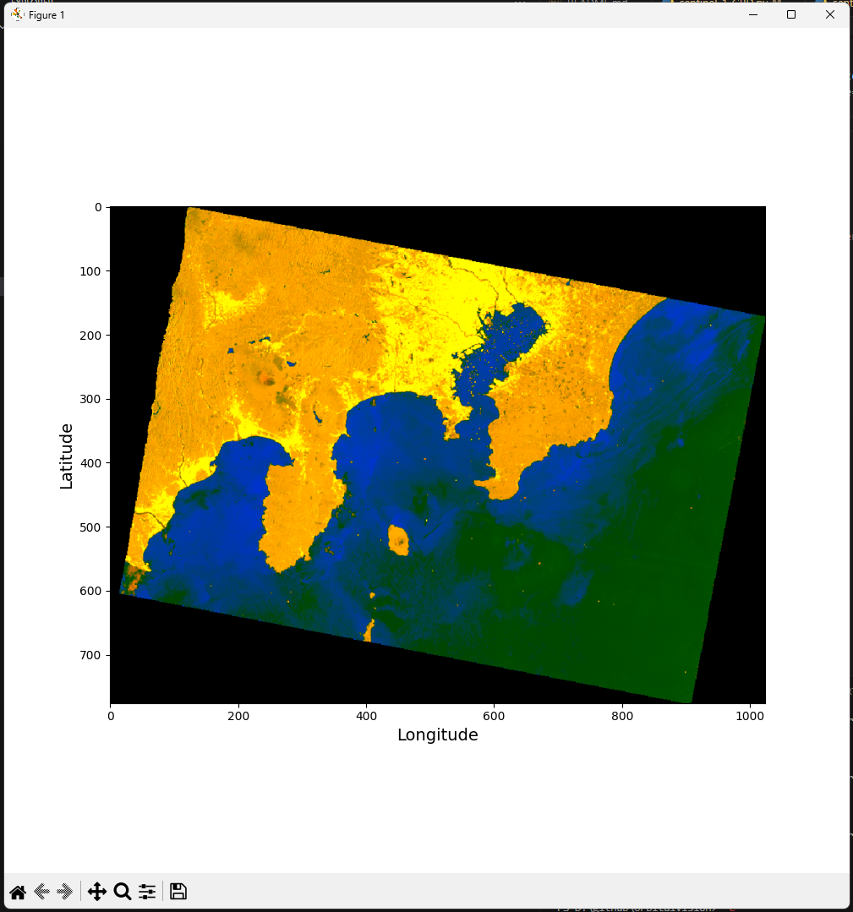

# 🛰️ OrbitalVision - Visualizing Earth from Space with Python

Welcome to **OrbitalVision**! This Python-powered project utilizes the **Microsoft Planetary Computer API** to download and visualize satellite imagery of Earth. Explore the beauty of our planet from above, with detailed views of continents, clouds, and city lights.

## 🌍 What does OrbitalVision do?

OrbitalVision allows you to:
- **Download high-resolution satellite images** from the Microsoft Planetary Computer.
- **Visualize these images** with ease, providing stunning views of Earth from space.
- Process images from popular datasets like **Sentinel-2** and **Landsat** collections.

# 🛠️ How to get started?

## 🥇 Prerequisites
- Python 3.12.5 or higher
- Hint: There is **no** API key needed for the [Microsoft Planetary Computer](https://planetarycomputer.microsoft.com/)

## 🥈 Installation
1. Clone the repository:

```bash
git clone https://github.com/yourusername/OrbitalVision.git
```

2. Install the required dependencies:

```powershell
pip install pystac_client rasterio
pip install pystac-client planetary-computer odc-stac matplotlib
pip install pystac-client planetary-computer rioxarray matplotlib
```

## 🥉 Running the project

```powershell
python template.py
```

# 📸 Example Output
Below is an example of satellite imagery visualized using OrbitalVision:

```powershell
python template.py
```

(View of Tokyo - Japan)


# 🌐 Modifying the Search Query

To customize the images you download, you can modify the following part of the code. Here’s what each parameter does:

```python
search = stac.search(
    collections=["sentinel-2-l2a"],
    bbox=[139.780726,35.625192,139.806798,35.644672],
    datetime="2022-12-01T10:00:00Z/2024-12-31T14:00:00Z",
    query={"eo:cloud_cover": {"lt": 20}},
    limit=40
)
```

## Parameters you can modify:

1. **`collections`**:  
   The dataset you are querying from. For example:
   - `"sentinel-2-l2a"` for Sentinel-2 Level-2A imagery
   - `"landsat-c2-l2"` for Landsat Collection 2 Level-2 imagery

   Change this depending on which dataset you want to pull from.

2. **`bbox` (Bounding Box)**:  
   Defines the geographical area for the search. This is a list in the format `[min_lon, min_lat, max_lon, max_lat]`. 
   - Example: `bbox=[139.780726, 35.625192, 139.806798, 35.644672]` specifies an area in Tokyo, Japan.  
   Modify this to query images from different parts of the world.

   With http://bboxfinder.com you will find your coordinates.

3. **`datetime`**:  
   The time range for your search in the format `"start_time/end_time"`.  
   - Example: `"2022-12-01T10:00:00Z/2024-12-31T14:00:00Z"`  
   Adjust the time range to get images from different time periods.

4. **`query`**:  
   You can filter the results based on certain criteria. In this case, we’re filtering for cloud cover with the `"eo:cloud_cover"` parameter:
   - `"lt": 20` means less than 20% cloud cover.  
   You can adjust this to allow for more or less cloud cover, or add other filters.

5. **`limit`**:  
   Limits the number of results returned.  
   - Example: `limit=40` fetches up to 40 images. You can change this depending on how many images you want to retrieve.

# 🚀 Future Improvements

* Support for additional satellite datasets.
* Image enhancement features to improve clarity and resolution.
* More interactive visualization options.

# 🤝 Contributions

Contributions are welcome! Feel free to fork the project and submit pull requests.

# 📸 More Example Output

Radiometrically terrain corrected SAR imagery derived from the Sentinel 1 Level 1 GRD product.
```powershell
python sentinel-1-RTC.py
```

(View of Tokyo - Japan)




# 📜 License

OrbitalView is licensed under the MIT License. See [LICENSE](LICENSE) for more information.

This project uses data and services provided by the [Microsoft Planetary Computer](https://planetarycomputer.microsoft.com/). The use of this API is subject to Microsoft's terms of service.

This project uses the Microsoft Planetary Computer API. All rights to the API and the data provided belong to Microsoft. This project is for educational purposes and does not claim any ownership of the external APIs used.